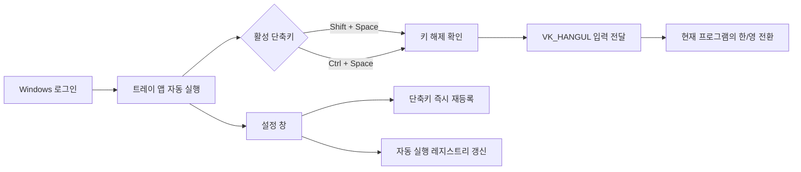

# 한/영 전환 도우미 설계

- 작성일: 2026-08-31
- 제품명: 한/영 전환 도우미
- 내부 식별자: `ShiftSpaceLangChange`
- 대상: 한국어 Microsoft IME가 설치된 Windows 10/11 64비트

## 1. 목적

사용자가 어느 프로그램에서 입력 중이든 `Shift + Space` 또는 `Ctrl + Space`를 눌러 한글과 영문 입력 상태를 전환할 수 있는 가벼운 Windows 상주 프로그램을 만든다. 사용자는 두 단축키 중 하나 또는 둘 다 활성화할 수 있고, 프로그램은 Windows 로그인 시 자동 실행된다.

## 2. 확정된 사용자 요구사항

- 시스템 트레이에 상주한다.
- 설정 창의 닫기 버튼은 프로그램을 종료하지 않고 트레이로 숨긴다.
- 완전 종료는 트레이 메뉴의 `종료`로 실행한다.
- `Shift + Space`와 `Ctrl + Space`는 설치 직후 모두 활성화한다.
- 두 단축키 중 최소 하나는 항상 활성화되어야 한다.
- `Windows 시작 시 자동 실행`은 설치 직후 활성화하며 설정에서 해제할 수 있다.
- 체크박스 변경은 저장 버튼 없이 즉시 적용한다.
- 메모리 사용량과 설치 용량을 작게 유지하기 위해 Rust와 Win32 API로 구현한다.
- 관리자 권한 없이 현재 사용자 범위에 설치하고 실행한다.

## 3. 범위 밖

- 사용자가 임의의 단축키를 직접 입력하는 기능
- 한글·영문 이외 언어의 입력 레이아웃 순환
- 클라우드 동기화, 계정, 원격 분석 및 광고
- 자동 업데이트 서버
- 관리자 권한으로 실행되는 프로그램에 입력을 강제로 전달하는 기능
- 유료 Authenticode 코드 서명
- Windows ARM64 및 32비트 빌드

## 4. 기술 선택

### 선택안

Rust 실행 파일 하나가 Win32 API를 직접 사용한다. WebView, Electron, .NET 런타임, 백그라운드 서비스는 사용하지 않는다.

### 선택 이유

- 네이티브 메시지 루프만 유지하므로 상주 메모리를 작게 유지할 수 있다.
- 전역 단축키, 트레이, 레지스트리, 입력 주입을 동일한 Windows API 계층에서 처리할 수 있다.
- 별도 런타임 설치가 필요하지 않다.

### Windows API

- `RegisterHotKey` / `UnregisterHotKey`: 전역 단축키 관리
- `MOD_NOREPEAT`: 키를 길게 눌렀을 때 반복 전환 방지
- `SendInput`: `VK_HANGUL` 누름·해제 입력 전달
- `GetAsyncKeyState`와 메시지 타이머: 실제 보조키가 놓인 뒤 입력 전달
- Shell notification icon API: 시스템 트레이 아이콘과 메뉴
- Win32 window/control API: 설정 창과 체크박스
- Registry API: 사용자 설정 및 자동 실행 관리
- Named mutex와 고정 창 클래스: 중복 실행 방지 및 기존 설정 창 활성화

## 5. 전체 구조



## 6. 모듈 경계

각 Rust 소스 파일은 500줄 미만을 유지하고 한 가지 책임만 갖는다.

| 모듈 | 책임 |
| --- | --- |
| `main` | Windows 하위 시스템 진입점과 최상위 오류 처리 |
| `app` | 메시지 루프, 생명주기, 모듈 조정 |
| `single_instance` | 사용자 세션 내 중복 실행 방지와 기존 창 표시 |
| `hotkeys` | 두 전역 단축키 등록·해제, 충돌 감지, 롤백 |
| `toggle_state` | 보조키 해제를 기다리는 플랫폼 독립 상태 머신 |
| `ime` | `SendInput`으로 `VK_HANGUL` 누름·해제 전달 |
| `settings` | 현재 사용자 레지스트리의 단축키 설정 읽기·쓰기 |
| `startup` | 현재 사용자 `Run` 항목 읽기·쓰기·삭제 |
| `ui` | 설정 창, 체크박스, 상태 및 오류 메시지 |
| `tray` | 트레이 아이콘, 설정 열기, 종료 메뉴 |

Win32 호출을 작은 인터페이스 뒤에 두어 설정 규칙과 전환 상태 머신은 macOS에서도 단위 테스트할 수 있게 한다.

## 7. 실행 및 입력 흐름

1. 프로그램 시작 시 named mutex를 획득한다.
2. 이미 실행 중이면 기존 설정 창을 앞으로 가져오고 새 프로세스는 종료한다.
3. 레지스트리에서 설정을 읽는다. 값이 없거나 손상되었으면 단축키 둘 다 활성화한 기본값으로 복구한다.
4. 활성 단축키를 `MOD_NOREPEAT`와 함께 등록한다.
5. 설정 창을 처음 직접 실행한 경우 표시하고, 자동 실행 인수 `--background`가 있으면 창을 숨긴 채 트레이에 상주한다.
6. `WM_HOTKEY`를 받으면 중복 요청을 막고 보조키와 Space가 놓였는지 메시지 타이머로 확인한다.
7. 키가 놓이면 `VK_HANGUL`의 key-down과 key-up을 한 번 전달한다.
8. 5초 안에 키 해제를 확인하지 못하면 요청을 취소하고 트레이 알림으로 안내한다.

`SendInput`은 Windows의 UIPI 정책을 따르므로 일반 권한으로 실행되는 이 앱은 관리자 권한 프로그램에 입력을 전달하지 못할 수 있다. 이를 피하기 위해 앱 전체를 관리자 권한으로 실행하거나 서비스를 설치하지 않는다.

## 8. 설정과 불변 조건

설정 경로는 `HKCU\Software\ShiftSpaceLangChange`이다.

| 값 | 형식 | 기본값 |
| --- | --- | --- |
| `ShiftSpaceEnabled` | DWORD 0/1 | 1 |
| `CtrlSpaceEnabled` | DWORD 0/1 | 1 |

자동 실행 상태는 별도 설정값을 복제하지 않고 `HKCU\Software\Microsoft\Windows\CurrentVersion\Run`의 실제 `ShiftSpaceLangChange` 항목 존재 여부로 판단한다. 등록 명령은 설치된 실행 파일의 절대 경로와 `--background` 인수를 포함한다.

적용 규칙은 다음과 같다.

- 마지막으로 남은 단축키를 끄려 하면 변경을 거부하고 안내한다.
- 단축키를 켤 때 등록에 실패하면 기존 등록과 저장값을 유지한다.
- 여러 설정을 갱신할 때는 새 구성을 먼저 시험하고 실패하면 직전의 유효한 구성으로 롤백한다.
- 레지스트리 쓰기에 실패하면 체크박스를 실제 상태로 되돌리고 오류를 표시한다.

## 9. 설정 창과 트레이

```text
┌─────────────────────────────────────────┐
│  한/영 전환 도우미                 ─ □ × │
├─────────────────────────────────────────┤
│  ● 실행 중                              │
│  선택한 단축키로 한/영 입력을 전환합니다. │
│                                         │
│  ☑  Shift + Space                       │
│  ☑  Ctrl + Space                        │
│                                         │
│  ─────────────────────────────────────  │
│  ☑  Windows 시작 시 자동 실행           │
│                                         │
│  설정은 선택 즉시 적용됩니다.            │
│                         [트레이로 숨기기] │
└─────────────────────────────────────────┘
```

- 네이티브 Windows 시스템 글꼴과 표준 컨트롤을 사용한다.
- 키보드 Tab 이동, Space 체크 전환, Escape로 트레이 숨기기를 지원한다.
- 체크박스마다 연결된 텍스트 레이블을 제공한다.
- 트레이 아이콘을 두 번 클릭하면 설정 창을 연다.
- 트레이 메뉴는 `설정 열기`, 현재 활성 단축키 요약, `종료`로 구성한다.
- 단축키 충돌이나 입력 실패는 설정 창의 상태 문구와 트레이 알림으로 알린다.

## 10. 설치와 제거

- Windows 10/11 x64 사용자 단위 NSIS 설치 프로그램을 만든다.
- 기본 설치 위치는 `%LOCALAPPDATA%\Programs\ShiftSpaceLangChange`이다.
- 설치 완료 시 자동 실행을 등록하고 프로그램을 한 번 실행한다.
- 제거 프로그램은 실행 중인 앱을 종료하도록 안내한 뒤 실행 파일, 시작 메뉴 바로가기, 자동 실행 항목, 앱 설정을 제거한다.
- GitHub Actions Windows 러너에서 릴리스 실행 파일과 NSIS 설치 파일을 생성하는 워크플로를 제공한다.
- 코드 서명은 포함하지 않으므로 SmartScreen이 경고할 수 있음을 릴리스 안내에 명시한다.

## 11. 오류 처리

| 상황 | 처리 |
| --- | --- |
| 단축키가 다른 앱에 선점됨 | 새 체크를 취소하고 충돌 메시지 표시 |
| 설정 레지스트리 손상 | 안전한 기본값으로 복구하고 다시 저장 |
| 자동 실행 쓰기 실패 | 실제 레지스트리 상태로 UI 복원 및 안내 |
| `SendInput` 실패 | 오류 상태 표시와 트레이 알림, 앱은 계속 실행 |
| 중복 실행 | 기존 설정 창 표시 후 새 프로세스 종료 |
| 한국어 IME 미설치 | 시작 안내에 필요 조건 표시; 앱 충돌 없이 유지 |
| 관리자 권한 앱이 전면에 있음 | UIPI 제한 안내; 권한 상승을 자동 요청하지 않음 |

## 12. 개인정보와 보안

- 키 입력 내용을 기록하거나 전송하지 않는다.
- 저수준 키보드 후킹 대신 지정한 두 전역 단축키만 Windows에 등록한다.
- 네트워크 통신, 분석 SDK, 계정 및 자동 업데이트를 포함하지 않는다.
- 설정은 현재 사용자 레지스트리에만 저장한다.
- 실행 시 관리자 권한을 요구하지 않는다.

## 13. 테스트 전략

### 자동 테스트

- 기본 설정은 두 단축키가 모두 켜져 있다.
- 최소 하나의 단축키가 활성화되어야 한다.
- 단축키 등록 실패 시 직전 구성으로 롤백한다.
- 손상된 레지스트리 값은 기본값으로 복구한다.
- 한 번의 hotkey 이벤트는 한 번의 IME 전환 요청만 만든다.
- 보조키가 눌린 동안에는 입력을 보내지 않는다.
- 키를 놓으면 한 번만 전송하고 반복 이벤트는 무시한다.
- 5초 타임아웃 시 요청을 취소한다.
- Windows 전용 통합 테스트에서 레지스트리 읽기·쓰기와 단축키 등록·해제를 검증한다.

모든 동작 변경은 실패하는 테스트를 먼저 확인한 뒤 최소 구현으로 통과시키는 TDD 순서를 따른다.

### Windows HVC

1. 새 Windows 사용자 계정에서 설치가 관리자 권한 없이 완료된다.
2. 메모장, 브라우저 입력창, Office 입력창에서 두 단축키가 각각 한/영을 한 번만 전환한다.
3. 한 단축키를 끄면 그 조합은 원래 동작으로 돌아가고 다른 조합은 계속 작동한다.
4. 마지막 단축키를 끌 수 없고 이해 가능한 안내가 표시된다.
5. 설정 창을 닫아도 트레이에 상주한다.
6. 로그아웃 후 로그인하면 창 없이 트레이에서 자동 실행된다.
7. 자동 실행을 끄면 다음 로그인부터 실행되지 않는다.
8. 두 번째 실행 시 프로세스가 중복되지 않고 기존 설정 창이 열린다.
9. 충돌하는 단축키를 다른 앱이 선점한 경우 설정이 롤백되고 안내가 표시된다.
10. 제거 후 실행 파일, 바로가기, 자동 실행 및 설정 레지스트리가 남지 않는다.
11. 작업 관리자에서 유휴 상태 메모리를 기록해 WebView나 별도 런타임 프로세스가 없음을 확인한다.

VoiceOver 및 음성 출력 검증은 범위에서 제외한다.

## 14. 완료 조건

- Rust 소스 파일이 모두 500줄 미만이다.
- 로직 단위 테스트와 Windows 통합 테스트가 통과한다.
- Windows x64 릴리스 빌드와 NSIS 패키징이 성공한다.
- 두 전역 단축키, 즉시 설정 반영, 자동 실행, 트레이 상주, 중복 실행 방지가 Windows PC에서 확인된다.
- 설치 및 제거 HVC 결과가 기록된다.
- 최종 보고서에 설치 파일을 받을 수 있는 직접 링크와 Windows HVC 확인 경로를 제공한다. 원격 저장소가 아직 없으면 링크를 만들 수 없는 상태임을 명시한다.

